<div align="center">

# SuperBizAgent

**面向企业知识库、智能运维诊断与可扩展工具调用的 AI Agent 后端服务**

SuperBizAgent 是一个基于 Spring Boot 3、Spring AI Alibaba、DashScope、Milvus 与 MySQL 构建的企业级 AI Agent 服务骨架。项目围绕企业知识问答、RAG 检索增强、AIOps 诊断、工具调用、MCP 扩展、Skills 能力包与长期/短期记忆管理展开，旨在提供一个可运行、可扩展、可审计的智能业务助手后端基础设施。

</div>

<p align="center">
  
  
  
  
  
  
</p>

---

## 项目定位

SuperBizAgent 不是一个简单的聊天接口，而是一个面向企业场景的 Agent 后端服务框架。

它将大模型能力、企业知识库、向量检索、工具调用、运维诊断、执行记忆和 MCP 扩展统一封装为一套 Spring Boot 后端服务，适合用于构建：

- 企业内部知识问答系统
- 运维告警智能诊断系统
- 面向日志、指标、文档和数据库的 AIOps 助手
- 支持工具治理和记忆沉淀的 Agent 后端
- 可接入 MCP Server 和 Skills 能力包的智能体平台原型

项目已经实现从文档上传、切分、Embedding、Milvus 向量入库，到多轮对话、SSE 流式响应、工具调用、诊断任务管理、长期记忆抽取、短期记忆压缩和外部 MCP 管理的一整套基础链路。

---

## 功能特性

| 模块 | 能力说明 |
|---|---|
| 智能对话 | 支持普通对话、SSE 流式对话、多轮会话、上下文维护与工具增强回答 |
| RAG 知识库 | 支持文档上传、文本切分、Embedding、Milvus 向量索引、TopK 召回 |
| AIOps 诊断 | 支持创建运维诊断任务，并结合指标、日志、知识库和工具结果生成分析 |
| Agent 工具系统 | 内置时间、内部文档检索、指标查询、日志查询、MySQL 查询、公开搜索、天气地图等工具 |
| MCP 扩展 | 支持远程 SSE / Streamable HTTP MCP Server 配置、启停、刷新与工具快照管理 |
| Skills 能力包 | 支持通过 ZIP URL 安装 Skill，将特定任务方法论注入 Agent 系统提示词 |
| 记忆系统 | 支持长期记忆文件、短期执行记忆、自动抽取、压缩和索引维护 |
| 本地控制台 | 提供 Spring Boot 静态页面，可直接访问本地 Web 控制台 |

---

## 系统截图

### 首页 / 对话控制台

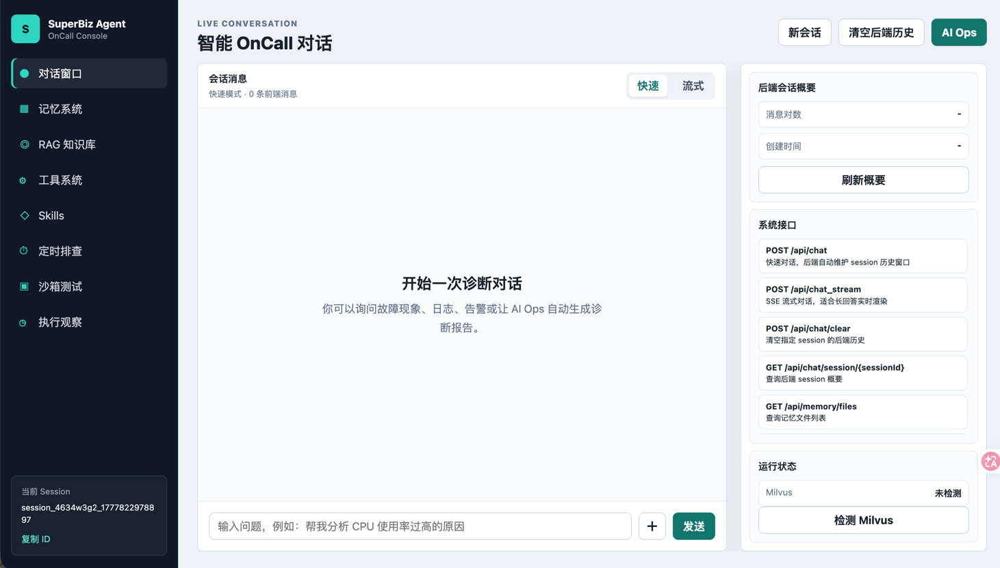

### 长短期记忆

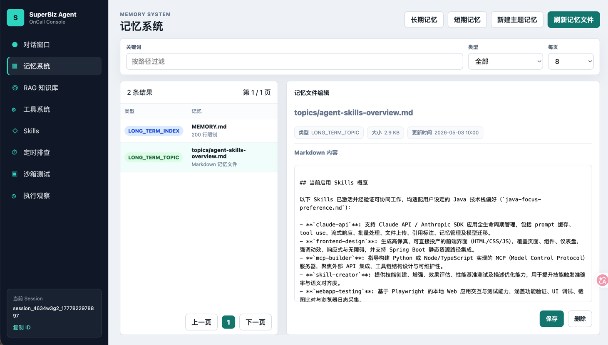

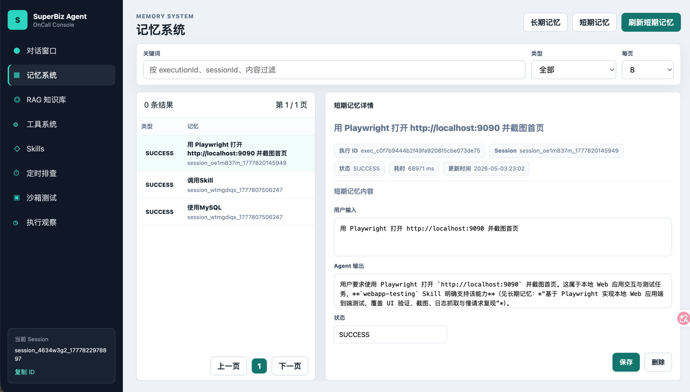

### RAG知识库

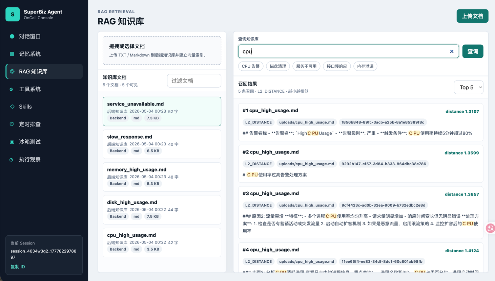

### Tools与MCP管理

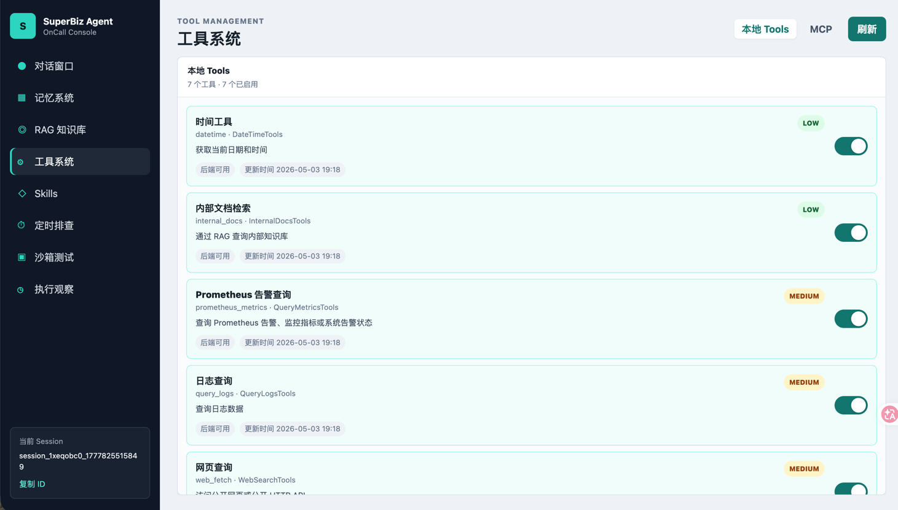
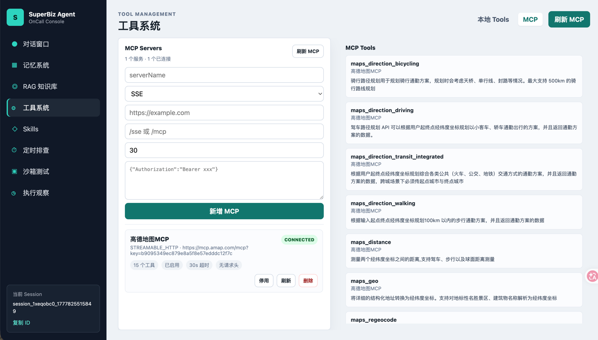

### Skills

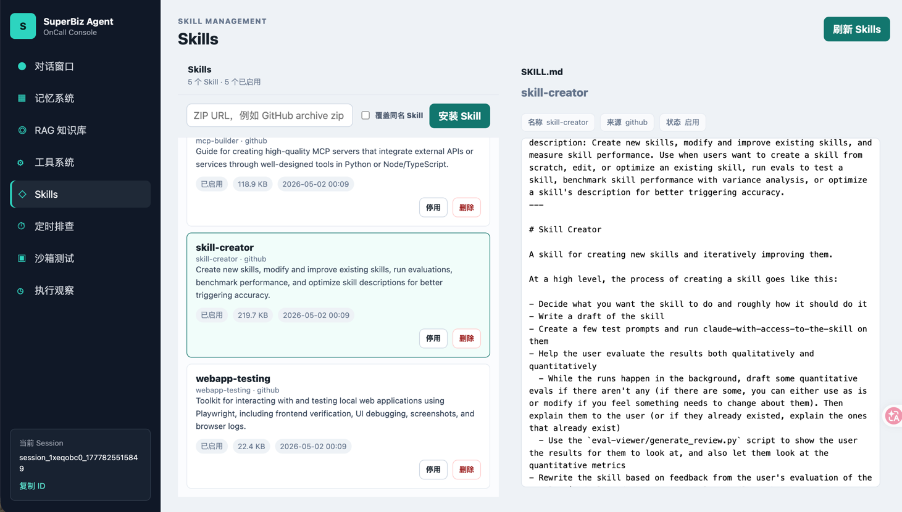

### 定时任务

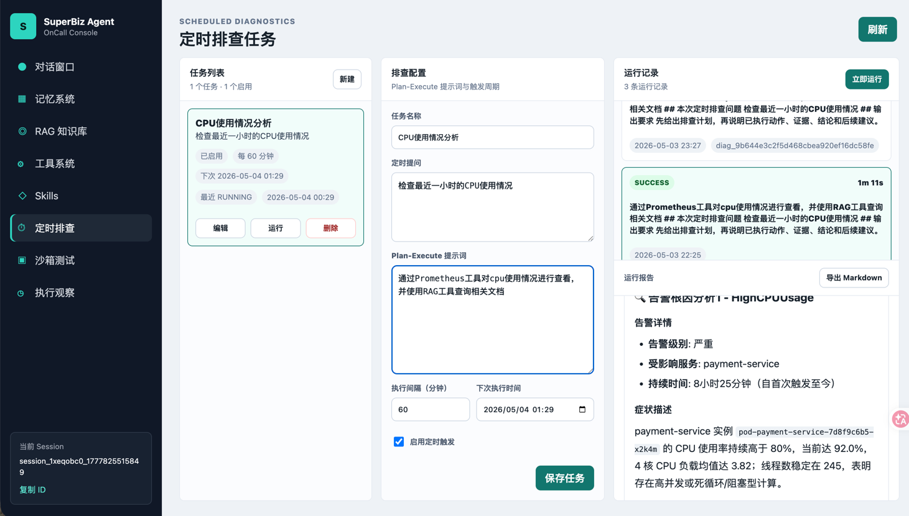

### 执行观察

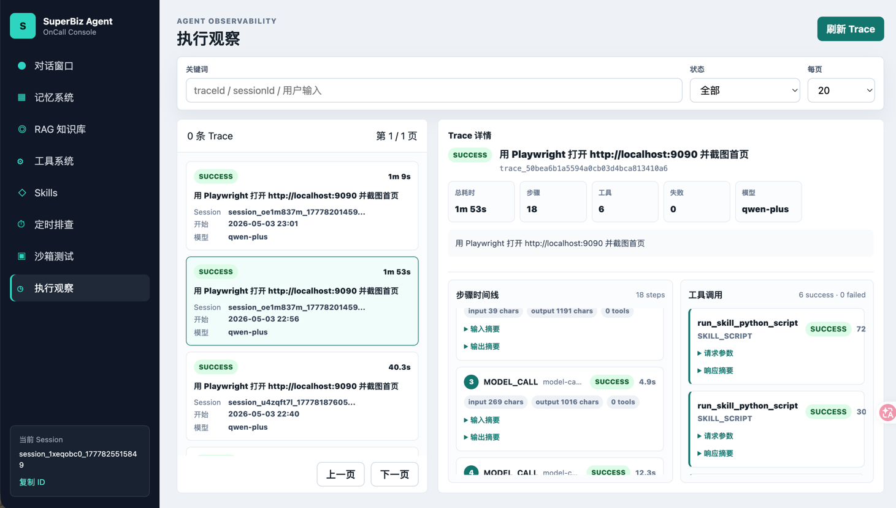

### 沙箱测试

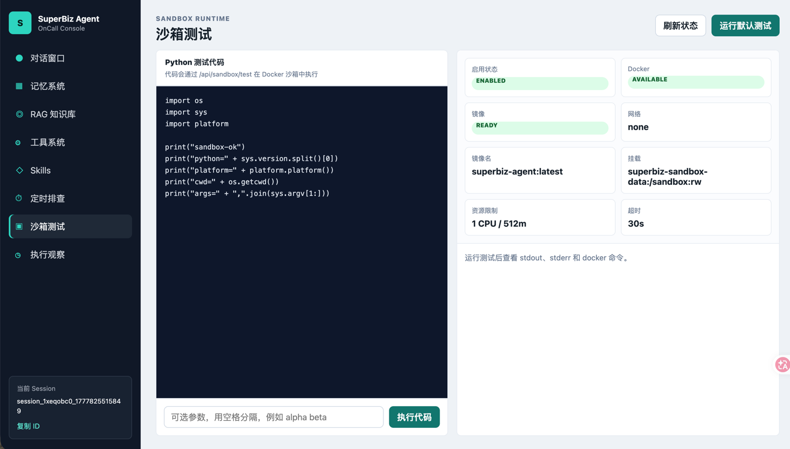
---

## 技术栈

| 类型 | 技术选型 |
|---|---|
| 语言 | Java 17 |
| 后端框架 | Spring Boot 3.2.0 |
| AI 框架 | Spring AI 1.1.0, Spring AI Alibaba 1.1.0.0-RC2 |
| 大模型服务 | DashScope / Qwen |
| Embedding | DashScope text-embedding-v4 |
| 向量数据库 | Milvus |
| 关系数据库 | MySQL 8 |
| ORM | MyBatis Plus |
| 流式响应 | Server-Sent Events |
| 工具协议 | Spring AI Tool Calling, MCP |
| 本地部署 | Docker, Docker Compose, Maven |

---

## 架构设计

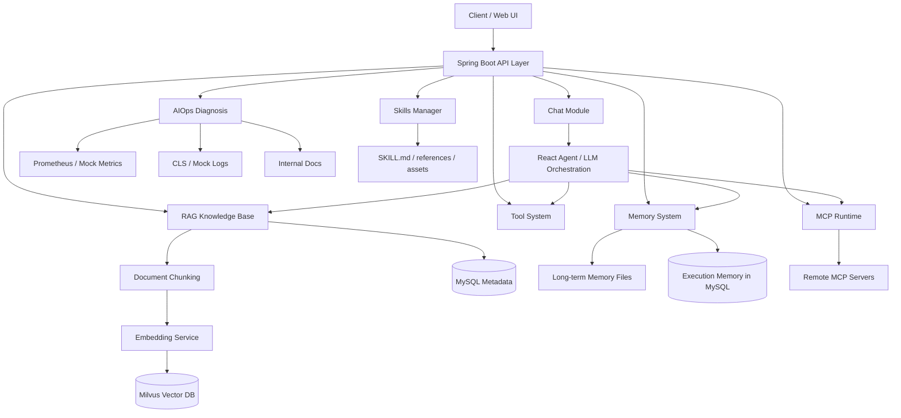

整体架构遵循“Agent 编排层 + 工具能力层 + 知识检索层 + 记忆沉淀层 + 外部扩展层”的设计思路。

其中，Agent 负责理解用户意图和组织推理流程；RAG 层负责提供企业知识上下文；工具层负责封装可审计的外部能力；MCP 层用于接入远程工具服务；记忆层负责保存会话和执行过程中的长期知识与短期状态。

---

## 目录结构

```text
.
├── aiops-docs/                  # 示例运维知识文档
├── docker/mysql/init/           # MySQL 初始化脚本
├── docs/
│   └── rag-api.md               # RAG API 详细说明
├── skills/                      # Skills 能力包目录
├── src/main/java/org/example/
│   ├── agent/tool/              # Agent 本地工具定义
│   ├── client/                  # 外部服务客户端封装
│   ├── config/                  # Spring / AI / 数据源配置
│   ├── controller/              # HTTP API 控制器
│   ├── dto/                     # 请求与响应 DTO
│   ├── entity/                  # MySQL 实体
│   ├── mapper/                  # MyBatis Plus Mapper
│   └── service/                 # 核心业务服务
├── src/main/resources/
│   ├── application.yml          # 主配置文件
│   └── static/                  # 本地 Web 控制台
├── uploads/                     # 上传后的知识库文件
├── vector-database.yml          # MySQL + Milvus 本地依赖
├── Dockerfile
├── Makefile
└── pom.xml
```

---

## 核心模块说明

### 1. 智能对话模块

对话模块提供普通问答和 SSE 流式问答接口，支持会话上下文维护、工具调用和长期记忆加载。

典型调用链路如下：

```text
ChatController
    -> ChatApplicationService
    -> ChatService / ChatStreamService
    -> ReactAgent
    -> Local Tools / MCP Tools / RAG Retrieval / Memory
```

普通对话适合接口调试和短文本回答，流式对话适合前端实时渲染模型输出。

---

### 2. RAG 知识库模块

RAG 模块完成从文档上传到向量召回的完整链路：

```text
Document Upload
    -> File Storage
    -> Metadata in MySQL
    -> Document Chunking
    -> DashScope Embedding
    -> Milvus Vector Index
    -> TopK Retrieval
```

当前适合处理企业内部 Markdown、运维文档、FAQ、故障处理手册等文本型知识。上传后，系统会保存原始文件、记录文档元数据，并将切分后的文本片段写入 Milvus。

---

### 3. AIOps 诊断模块

AIOps 模块面向运维告警诊断场景。用户可以提交告警名称、级别、描述等信息，系统结合指标、日志、知识库和工具结果生成诊断建议。

本地默认启用 Mock 模式，便于在没有真实 Prometheus 或 CLS 环境的情况下验证完整流程。接入真实环境时，可以关闭 Mock 并配置真实服务地址。

---

### 4. 工具系统

工具系统将 Agent 可调用能力分为三类：

| 类型 | 说明 |
|---|---|
| Local Tools | 后端 Java 工具，通过 Spring AI `@Tool` 暴露，适合封装强约束、可审计能力 |
| MCP Tools | 远程 MCP Server 暴露的工具，适合接入外部系统能力 |
| Skills | 面向任务的方法论提示词包，用于增强 Agent 的任务执行风格和约束 |

本地工具由后端代码定义，前端只负责展示和启停，不允许页面动态新增任意本地命令，从而降低工具滥用风险。

工具开关会落库到 MySQL，应用启动时自动补齐默认配置，运行时通过内存快照向对话线程提供可用工具列表。

---

### 5. MCP 管理模块

MCP Server 配置支持在前端或 API 中管理，并持久化到 MySQL。

当前支持：

- SSE
- Streamable HTTP
- Header 鉴权配置
- Server 启用 / 停用
- 单个 Server 刷新
- 全部 Server 刷新
- MCP 工具快照查询

系统采用运行时快照模式，管理接口变更配置后会重建连接并原子替换工具回调快照。对话线程只读取当前快照，不在请求过程中反复查询数据库或重建连接。

---

### 6. Skills 能力包

Skills 用于给 Agent 注入特定任务的工作方法、约束和示例。

一个 Skill 是一个目录，至少包含：

```text
skill-name/
├── SKILL.md
├── references/
├── scripts/
└── assets/
```

当前版本中，Skills 主要作为提示词能力包使用。系统会根据用户输入与 Skill 名称、描述和 `SKILL.md` 内容进行轻量匹配，最多加载 3 个相关 Skill 注入系统提示词。

当前不会直接执行 Skill 目录中的脚本，动作执行仍由 Local Tools 或 MCP Tools 完成。

---

### 7. 记忆系统

记忆系统分为长期记忆和短期记忆。

| 类型 | 存储 | 用途 |
|---|---|---|
| 长期记忆 | `./memory/MEMORY.md` 与 `memory/topics/*.md` | 保存长期有效的用户偏好、项目背景和任务知识 |
| 短期记忆 | MySQL `agent_execution_memory` | 保存 Agent 每次执行的输入、输出、状态和上下文快照 |

长期记忆支持自动抽取。系统会在成功对话后判断本轮内容是否值得长期保存，并在达到阈值后批量回顾最近记录。短期记忆支持自动压缩，避免会话持续增长导致上下文过长。

---

## 快速开始

### 1. 克隆项目

```bash
git clone https://github.com/zyccccgis/superagent.git
cd superagent
```

### 2. 配置环境变量

至少需要配置 DashScope API Key：

```bash
export DASHSCOPE_API_KEY="your-api-key"
```

如果不使用默认 MySQL 配置，可以覆盖数据源：

```bash
export SPRING_DATASOURCE_URL="jdbc:mysql://localhost:3306/superbiz_agent?useSSL=false&serverTimezone=Asia/Shanghai&characterEncoding=utf8"
export SPRING_DATASOURCE_USERNAME="superbiz"
export SPRING_DATASOURCE_PASSWORD="superbiz1234"
```

### 3. 启动基础依赖

```bash
docker-compose -f vector-database.yml up -d
```

该命令会启动 MySQL、Milvus、Attu、MinIO 等本地依赖。

默认服务地址：

| 服务 | 地址 |
|---|---|
| MySQL | `localhost:3306` |
| Milvus | `localhost:19530` |
| Attu | `http://localhost:8000` |
| MinIO Console | `http://localhost:9001` |

默认 MySQL 配置：

```text
database: superbiz_agent
username: superbiz
password: superbiz1234
root password: root1234
```

### 4. 启动应用

```bash
mvn spring-boot:run
```

默认访问地址：

```text
http://localhost:9900
```

### 5. 检查 Milvus 状态

```bash
curl http://localhost:9900/milvus/health
```

如果返回 `message: ok`，说明应用已经正常连接 Milvus。

---

## API 示例

### 上传知识库文档

```bash
curl -X POST http://localhost:9900/api/rag/documents \
  -F "file=@aiops-docs/cpu_high_usage.md"
```

### 批量导入示例文档

```bash
for file in aiops-docs/*.md; do
  curl -X POST http://localhost:9900/api/rag/documents \
    -F "file=@${file}"
done
```

### 查询文档列表

```bash
curl "http://localhost:9900/api/rag/documents?page=1&pageSize=20&keyword=cpu"
```

### 测试向量召回

```bash
curl -X POST http://localhost:9900/api/rag/retrieve \
  -H "Content-Type: application/json" \
  -d '{"text":"CPU 使用率过高怎么排查","topK":5}'
```

### 普通对话

```bash
curl -X POST http://localhost:9900/api/chat \
  -H "Content-Type: application/json" \
  -d '{"Id":"demo-session","Question":"CPU 使用率过高应该怎么排查？"}'
```

### SSE 流式对话

```bash
curl -N -X POST http://localhost:9900/api/chat_stream \
  -H "Content-Type: application/json" \
  -d '{"Id":"demo-session","Question":"请总结磁盘空间告警的处理流程"}'
```

### 创建 AIOps 诊断任务

```bash
curl -X POST http://localhost:9900/api/ai_ops/tasks \
  -H "Content-Type: application/json" \
  -d '{
    "alertName":"CPUHighUsage",
    "severity":"critical",
    "description":"prod-app-01 CPU 使用率持续高于 90%"
  }'
```

### 查询诊断任务

```bash
curl http://localhost:9900/api/ai_ops/tasks/{taskId}
```

---

## 主要配置

核心配置文件位于：

```text
src/main/resources/application.yml
```

关键配置示例：

```yaml
server:
  port: 9900

file:
  upload:
    path: ./uploads
    allowed-extensions: txt,md

milvus:
  host: 127.0.0.1
  port: 19530
  database: default

spring:
  datasource:
    url: ${SPRING_DATASOURCE_URL:jdbc:mysql://localhost:3306/superbiz_agent?useSSL=false&serverTimezone=Asia/Shanghai&characterEncoding=utf8}
    username: ${SPRING_DATASOURCE_USERNAME:superbiz}
    password: ${SPRING_DATASOURCE_PASSWORD:superbiz1234}
  ai:
    dashscope:
      api-key: ${DASHSCOPE_API_KEY:}

dashscope:
  embedding:
    model: text-embedding-v4

document:
  chunk:
    max-size: 800
    overlap: 100

rag:
  top-k: 3
  model: qwen3-max

memory:
  base-path: ./memory
  short-memory-pairs: 6
  short-compression:
    enabled: true
    threshold: 12
    keep-recent: 6
    max-records: 30
  long-extraction:
    enabled: true
    success-threshold: 5
    before-compression: true

prometheus:
  base-url: http://localhost:9090
  mock-enabled: true

cls:
  mock-enabled: true

mysql:
  tool:
    enabled: false

web:
  tool:
    enabled: true

agent:
  safety:
    model-call-limit: 6
    tool-call-limit: 12
```

---

## 工具开关

| 配置项 | 默认值 | 说明 |
|---|---:|---|
| `prometheus.mock-enabled` | `true` | 指标查询使用模拟数据 |
| `cls.mock-enabled` | `true` | 日志查询使用模拟数据 |
| `mysql.tool.enabled` | `false` | 是否启用 MySQL 查询工具 |
| `web.tool.enabled` | `true` | 是否启用外网查询工具 |
| `spring.ai.mcp.client.enabled` | `false` | 是否启用 MCP 客户端 |
| `memory.short-compression.enabled` | `true` | 是否自动压缩旧短期记忆 |
| `memory.long-extraction.enabled` | `true` | 是否自动抽取长期记忆 |

生产环境开启真实工具前，建议限制数据库账号权限、查询超时时间、网络访问范围和工具调用上限。

---

## 数据存储

| 数据类型 | 存储位置 |
|---|---|
| 上传文件 | `./uploads` |
| 长期记忆文件 | `./memory` |
| Skills 能力包 | `./skills` |
| RAG 文档元数据 | MySQL `rag_documents` |
| AIOps 诊断任务 | MySQL `agent_diagnostic_task` |
| Agent 执行记忆 | MySQL `agent_execution_memory` |
| 本地工具开关 | MySQL `tool_config` |
| MCP Server 配置 | MySQL `mcp_server_config` |
| 文档向量 | Milvus |
| Docker 持久化数据 | `./volumes` |

---

## 常用开发命令

```bash
# 编译
mvn clean package

# 启动应用
mvn spring-boot:run

# 启动本地依赖
docker-compose -f vector-database.yml up -d

# 停止本地依赖
docker-compose -f vector-database.yml down

# 查看容器状态
docker ps

# 查看 Makefile 帮助
make help
```

---

## 适用场景

SuperBizAgent 适合用于以下项目或简历场景：

- 企业知识库 RAG 系统
- 运维智能问答助手
- AIOps 根因分析原型
- 支持工具调用的智能体后端
- Spring AI / Spring AI Alibaba 工程实践
- MCP 工具接入与治理平台
- 带长期记忆与短期执行记忆的 Agent 服务

---

## 后续规划

- 支持更多文件类型解析，如 PDF、DOCX、HTML
- 引入混合检索策略，如 BM25 + 向量召回 + Reranker
- 增强 AIOps 诊断链路，支持指标趋势、日志聚类和根因路径推理
- 增加工具调用审计、权限控制和敏感操作拦截
- 支持多租户知识库和用户级隔离
- 将 Skills 与向量检索结合，提升能力包匹配准确率
- 引入 Agent 评测集，衡量召回质量、回答质量和工具调用准确率

---

## 常见问题

### DashScope 调用失败

检查 `DASHSCOPE_API_KEY` 是否已经在启动应用的 shell 中生效。

```bash
echo $DASHSCOPE_API_KEY
```

### Milvus 健康检查失败

检查 Milvus、etcd、MinIO 容器是否启动完成。

```bash
docker ps
curl http://localhost:9900/milvus/health
```

### 上传文档失败

确认文件类型是否为 `txt` 或 `md`，并检查 DashScope 与 Milvus 服务状态。

### MySQL 连接失败

检查 `superbiz-mysql` 容器、3306 端口和账号密码。

### AIOps 诊断只有模拟数据

默认开启 Mock 模式。接入真实环境时，需要关闭：

```yaml
prometheus:
  mock-enabled: false

cls:
  mock-enabled: false
```

### Agent 过早停止

可以适当调整：

```yaml
agent:
  safety:
    model-call-limit: 6
    tool-call-limit: 12
```

---

## License

This project is licensed under the Apache License 2.0.
